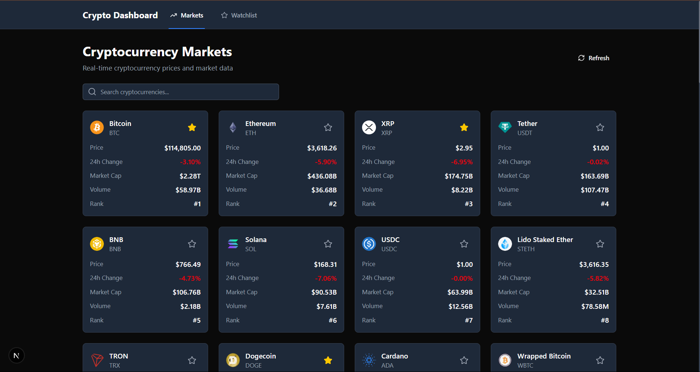

# Crypto Dashboard

A modern, feature-rich cryptocurrency dashboard built with Next.js 15, TypeScript, and Tailwind CSS. Track real-time cryptocurrency prices, view interactive charts, and manage your personal watchlist.


(public/crypto info.png)

## ✨ Features

- **💹 Live Market Data**: Real-time cryptocurrency prices and market information via CoinGecko API
- **📈 Interactive Charts**: 
  - Beautiful area charts with gradient fills
  - Multiple time ranges (24H, 7D, 30D, 90D)
  - Price change indicators
  - Responsive tooltips
- **🔍 Smart Search**: Instant cryptocurrency search with debounced input
- **⭐ Watchlist**: Persistent watchlist functionality using localStorage
- **🎨 Modern UI**:
  - Clean, modern design with shadcn/ui components
  - Responsive layout for all devices
  - Dark mode support
  - Loading skeletons for better UX
- **📱 Fully Responsive**: Works seamlessly on desktop, tablet, and mobile
- **🌙 Dark Mode**: Automatic dark mode detection and theme switching

## 🛠️ Tech Stack

- **Framework**: [Next.js 15](https://nextjs.org/) with App Router
- **Language**: [TypeScript](https://www.typescriptlang.org/)
- **Styling**: 
  - [Tailwind CSS](https://tailwindcss.com/)
  - [shadcn/ui](https://ui.shadcn.com/) components
- **Charts**: [Recharts](https://recharts.org/)
- **State Management**: React Hooks
- **Data Fetching**: [Axios](https://axios-http.com/)
- **Icons**: [Lucide React](https://lucide.dev/)

## 🚀 Getting Started

### Prerequisites

- Node.js 18 or later
- npm or yarn

### Installation

1. Clone the repository:
   ```bash
   git clone https://github.com/yourusername/crypto-dashboard.git
   cd crypto-dashboard
   ```

2. Install dependencies:
   ```bash
   npm install
   # or
   yarn
   ```

3. Start the development server:
   ```bash
   npm run dev
   # or
   yarn dev
   ```

4. Open [http://localhost:3000](http://localhost:3000) in your browser

## 📖 Project Structure

```
crypto-dashboard/
├── src/
│   ├── app/                   # Next.js app router pages
│   ├── components/            # React components
│   │   ├── ui/               # Reusable UI components
│   │   └── ...               # Feature components
│   └── lib/                  # Utilities and API functions
├── public/                   # Static assets
└── ...config files
```

## 🔥 Key Features Explained

### Interactive Charts
- Real-time price data visualization
- Multiple time range selections
- Gradient area charts with tooltips
- Price change indicators

### Watchlist Management
- Add/remove cryptocurrencies
- Persistent storage
- Quick access to favorite coins

### Market Data
- Live prices and market caps
- 24h price changes
- Trading volume
- Supply information

## 📱 Responsive Design

The dashboard is fully responsive and optimized for:
- 💻 Desktop (1024px and above)
- 📱 Tablet (768px to 1023px)
- 📱 Mobile (below 768px)

## 🤝 Contributing

Contributions are welcome! Please feel free to submit a Pull Request.

## 📝 License

This project is licensed under the MIT License - see the [LICENSE](LICENSE) file for details.

## 💖 Acknowledgements

- [CoinGecko API](https://www.coingecko.com/en/api) for cryptocurrency data
- [shadcn/ui](https://ui.shadcn.com/) for beautiful UI components
- [Recharts](https://recharts.org/) for the charting library
- [Tailwind CSS](https://tailwindcss.com/) for styling

### Installation

1. Clone the repository:
```bash
git clone <repository-url>
cd crypto-dashboard
```

2. Install dependencies:
```bash
npm install
```

3. Run the development server:
```bash
npm run dev
```

4. Open [http://localhost:3000](http://localhost:3000) in your browser.

### API Setup

This project uses the CoinGecko API. The API is free to use with rate limits:

1. Visit [CoinGecko Developers](https://www.coingecko.com/en/developers/dashboard)
2. Create a free account
3. Get your API key (optional for basic usage)
4. The app works without an API key but has rate limits

## Project Structure

```
src/
├── app/                    # Next.js App Router
│   ├── coin/[id]/         # Coin detail pages
│   ├── watchlist/         # Watchlist page
│   ├── globals.css        # Global styles
│   ├── layout.tsx         # Root layout
│   └── page.tsx           # Home page (markets)
├── components/            # React components
│   ├── ui/               # Reusable UI components
│   ├── coin-card.tsx     # Individual coin display
│   ├── navigation.tsx    # Site navigation
│   ├── price-chart.tsx   # Price chart component
│   └── search-bar.tsx    # Search functionality
└── lib/                  # Utilities and API
    ├── api.ts            # CoinGecko API functions
    └── utils.ts          # Helper functions
```

## Features in Detail

### Markets Page
- Displays top 50 cryptocurrencies by market cap
- Pagination support
- Real-time price updates
- Search functionality with debouncing
- Loading skeletons and error states

### Coin Detail Page
- Comprehensive coin information
- Interactive price charts
- Market statistics
- External links to official websites
- Watchlist integration

### Watchlist
- Persistent localStorage storage
- Add/remove coins with star button
- Real-time price updates
- Empty state with helpful messaging

## Deployment

### Deploy to Vercel

1. Push your code to GitHub
2. Connect your repository to Vercel
3. Deploy automatically

```bash
npm run build
```

### Environment Variables

No environment variables are required for basic functionality. The CoinGecko API works without authentication for public endpoints.

## API Endpoints Used

- `/coins/markets` - Get market data for cryptocurrencies
- `/coins/{id}` - Get detailed information for a specific coin
- `/coins/{id}/market_chart` - Get price chart data
- `/search` - Search for cryptocurrencies

## Contributing

1. Fork the repository
2. Create a feature branch
3. Make your changes
4. Add tests if applicable
5. Submit a pull request

## License

This project is open source and available under the [MIT License](LICENSE).

## Acknowledgments

- [CoinGecko](https://coingecko.com/) for providing the cryptocurrency API
- [Recharts](https://recharts.org/) for the charting library
- [Lucide](https://lucide.dev/) for the beautiful icons
- [Tailwind CSS](https://tailwindcss.com/) for the utility-first CSS framework
